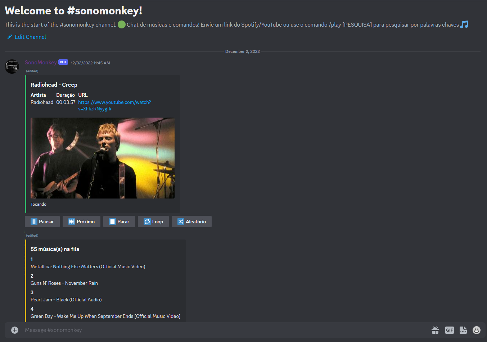

# ❤ SonoMonkey

Bot de músicas para discord criado em Python usando o framework Discord.py.

SonoMonkey utiliza exlusivamente as slash commands (commandos chamados com a "/") além de conter um menu interativo com botões e 
informações da música atual. Suporte total a mídias do YouTube ou do Spotify, tanto URLS de vídeos quanto de playlists são
aceitas. Há também a opção de procurar uma música pelo nome, nesse caso a procura é realizada diretamente no YouTube.

É utilizado um server Lavalink para enviar as músicas para o bot sem a necessidade de precisar baixar-las.
Portanto será necessário hospedar um a parte, ou encontrar algum gratuito na internet.

O Spotify não permite a reprodução de seu contéudo externamente, portanto para o suporte há links do Spotify serem possíveis 
é preciso um registro na sua API. Uma vez registrado será usado suas credenciais para obter informações das músicas e procurar-las no YouTube. 

Para usar o bot é necessário criar um arquivo de ambiente (.env) e inserir as seguintes informações

`TOKEN=TOKEN_DO_SEU_BOT`
`SPOTIFY_ID=ID_DA_SUA_API_DO_SPOTIFY`
`SPOTIFY_SECRET=SECRET_DA_SUA_API_DO_SPOTIFY`
`LAVALINK_HOST=NOME_DO_HOST_DO_LAVALINK`
`LAVALINK_PASSWORD=SENHA_DO_LAVALINK`

A importação dessas váriaveis é feita automaticamente dentro do código.

## Funcionalidades 🎶

- Pausar músicas.
- Pular música atual.
- Adicionar música atual em loop.
- Embaralhar playlist.
- Menu interativo.
- Playlist interativa.
- Sistema de log de músicas tocadas.
- Suporte para links(individuais ou playlist) do YouTube e do Spotify.
- Suporte para pesquisas por texto.
- Sair automaticamente e limpar fila quando todos sairem do canal.
- Adicionar uma música especifíca em outro lugar na fila.
- E mais!

## 🛠 Tecnologias e Libs

- Python
- Discord.py
- Wavelink
- Lavalink
